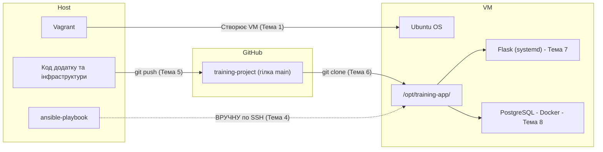
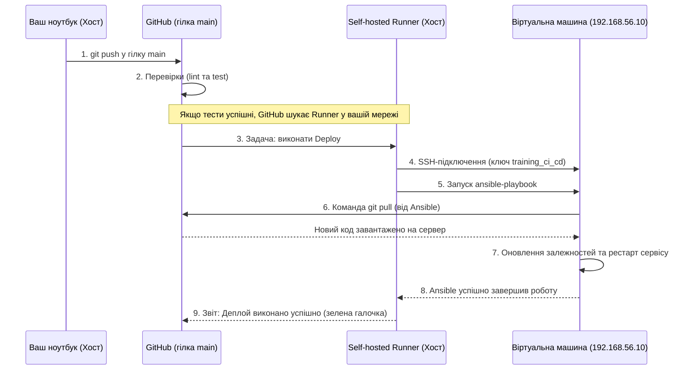
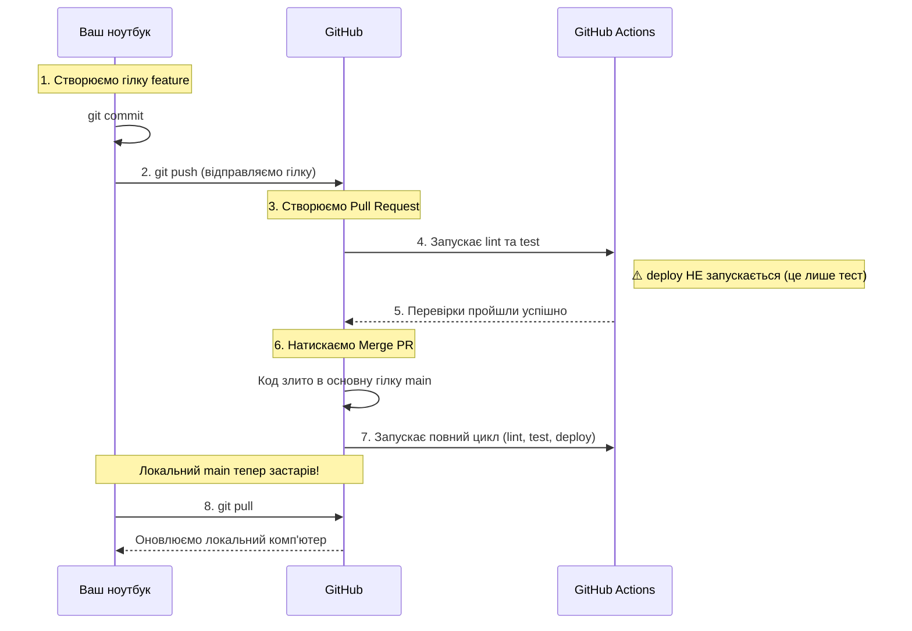

# Тема 9: Автоматизація конвеєра — CI/CD — Лабораторна робота

> **Файл для студентів.** Практична частина до теорії `09_CI_CD_Theory.md`.

---

## 🗺 Де ми зараз? Підсумок пройденого шляху

Перш ніж почати, зупинимось на хвилину. Ця лабораторна — не ізольоване завдання. Вона є прямим логічним продовженням усього, що ми будували з Теми 6. Подивимось, що вже зроблено і де ми знаходимось.

### Що ми маємо після Тем 6–8

| Етап / Тема        | Що ми автоматизували                                                                                                                                                                            | Результат                                                                                                |
| -------------------------- | ----------------------------------------------------------------------------------------------------------------------------------------------------------------------------------------------------------------- | ----------------------------------------------------------------------------------------------------------------- |
| **1. Vagrant**       | Створення самої віртуальної машини "з нуля". Сам Vagrant також вміє автоматично викликати Ansible одразу після створення. | `vagrant up` → створюється і стартує чиста VM Ubuntu                                   |
| **6. IaC (Ansible)** | Написали playbook, який налаштовує сервер: створює користувача `training`, встановлює Python, клонує код з GitHub, створює `.env`    | `ansible-playbook playbook.yml` → порожній сервер стає готовим                        |
| **7. systemd**       | Написали unit-файл `training-app.service`, додали його розгортання в playbook                                                                                                 | Flask працює 24/7, перезапускається після збою і виживає після reboot |
| **8. Docker**        | Додали `docker-compose.yml` з PostgreSQL, розширили playbook                                                                                                                                    | `ansible-playbook` тепер також встановлює Docker і піднімає базу даних    |

**Ключова думка:** увесь ланцюжок інфраструктури вже описано кодом. `Vagrantfile` піднімає сервер, а `playbook.yml` налаштовує на ньому систему, сервіс і базу даних.

### Поточна архітектура: три середовища і зв'язки між ними

Ось як виглядає наша інфраструктура після Тем 6–8. Три середовища, три ролі:



**Що тут що:**

| Середовище | Роль                                   | Що там живе                                             |
| -------------------- | ------------------------------------------ | ---------------------------------------------------------------- |
| 💻 Хост          | Робоче місце інженера   | Ваш код, Ansible, Git                                      |
| ☁️ GitHub          | Single Source of Truth                     | Репозиторій `training-project`, гілка `main` |
| 🖥️ VM              | Сервер (імітація production) | Flask (systemd) + PostgreSQL (Docker)                            |

Зверніть увагу на пунктирну стрілку `🖐 ВРУЧНУ`. Саме вона — точка болю.

### Але є одна проблема

Хто і коли запускає цю команду?

Поки що — ви самі, вручну, в терміналі, коли вважаєте за потрібне. Це означає:

- Зміна коду в GitHub не потрапляє на сервер автоматично.
- Якщо ви запушили код із синтаксичною помилкою — ніхто не попередить вас до того, як він потрапить на сервер.
- Немає жодної гарантії, що останній код у `main` дійсно працездатний.

### Логічний наступний крок

Саме тут і з'являється **CI/CD**: автоматична система, яка:

1. **При кожному `git push`** перевіряє код (тести, lint) — це **CI (Continuous Integration)**.
2. **Якщо перевірки пройшли** — запускає `ansible-playbook` сама — це **CD (Continuous Delivery)**.

Те, що ви робили вручну протягом трьох тем, тепер стане автоматичним. І ви вже знаєте всі деталі, з яких складається цей пазл: Git (Тема 5), SSH-ключі (Тема 4), Ansible (Тема 6), `/health`-ендпоінт (Тема 6). CI/CD лише з'єднує їх разом.

---

## 🎯 Мета роботи

Налаштувати перший CI/CD pipeline для `training-project`: автоматично перевіряти Ansible playbook, запускати тест Flask-додатку і підготувати безпечний deploy через GitHub Actions та Ansible. Після виконання роботи студент матиме workflow-файл, який запускається при `push` та Pull Request і не дозволяє деплоїти код, якщо перевірки не пройшли.

---

## 🛠 Покрокова інструкція

### Крок 1: Перевірка передумов

Переконаємось, що `training-project` після попередніх тем знаходиться у робочому стані.

На **хості**:

```bash
cd ~/devops-course/training-project/

# Перевіряємо, що VM запущена
vagrant status

# Перевіряємо, що сервіс з Теми 7 працює
ssh vagrant@192.168.56.10 "sudo systemctl is-active training-app"

# Перевіряємо, що health-endpoint відповідає
ssh vagrant@192.168.56.10 "curl -s http://localhost:5000/health"
```

**Очікуваний результат:** VM має статус `running`, сервіс повертає `active`, а `/health` відповідає `{"status":"ok"}`.

Якщо щось не працює — спочатку запустіть playbook з Теми 8:

```bash
cd ~/devops-course/training-project/ansible/
ansible-playbook playbook.yml -e "db_password=ВашПароль123"
```

---

### Крок 2: Додаємо тест для Flask-додатку

CI має перевіряти не лише Ansible playbook, а й мінімальну поведінку застосунку. У нас уже є `/health`, тому напишемо простий автоматичний тест.

На **хості**, у корені `training-project`:

```bash
# Створюємо каталог для тестів
mkdir -p tests

# Створюємо файл тесту
touch tests/test_app.py
```

Відкрийте `tests/test_app.py` і додайте:

```python
# Імпортуємо Flask-застосунок із головного файлу проєкту
from app import app


def test_health_endpoint():
    # Створюємо тестового клієнта Flask без запуску реального сервера
    client = app.test_client()

    # Імітуємо HTTP-запит до endpoint /health
    response = client.get("/health")

    # Перевіряємо, що endpoint відповів успішно
    assert response.status_code == 200

    # Перевіряємо, що застосунок повернув очікуваний JSON
    assert response.get_json() == {"status": "ok"}
```

Цей файл імітує дуже просту, але типову ситуацію CI: після чергової зміни коду pipeline автоматично перевіряє, що базовий endpoint застосунку все ще працює правильно.

Тут `assert` означає перевірку очікуваного результату:

- `assert response.status_code == 200` перевіряє, що endpoint `/health` відповів без помилки.
- `assert response.get_json() == {"status": "ok"}` перевіряє, що застосунок повернув саме той JSON, який ми очікуємо.

Якщо хоча б одна з цих перевірок не виконується, `pytest` позначає тест як failed.

Створіть файл залежностей для розробки:

```bash
touch requirements-dev.txt
```

Відкрийте `requirements-dev.txt` і додайте:

```text
-r requirements.txt
pytest
```

**Чому окремий `requirements-dev.txt`?** `requirements.txt` описує залежності застосунку для запуску, а `requirements-dev.txt` — інструменти для перевірки під час розробки та CI. `pytest` потрібен pipeline, але не обов'язково потрібен самому production-сервісу.

Переконайтесь, що локальні службові каталоги не потраплять у Git:

```bash
# Додайте ці рядки до .gitignore, якщо їх ще немає
echo -e ".venv/\n.pytest_cache/\n__pycache__/" >> .gitignore
```

---

### Крок 3: Локальна перевірка перед GitHub Actions

Перед тим як просити GitHub запускати перевірки, переконаємось, що вони проходять на нашому комп'ютері. Pipeline не має бути першим місцем, де ми дізнаємось про очевидну помилку.

На **хості**, у корені `training-project`:

```bash
# Створюємо локальне середовище, якщо його ще немає
python3 -m venv .venv
source .venv/bin/activate

# Встановлюємо залежності для тестів
pip install -r requirements-dev.txt

# Запускаємо тест
pytest -q
```

**Очікуваний результат:** один тест пройшов успішно.

Тепер перевіримо Ansible playbook локально, у вашій папці з репозиторієм. На цьому етапі ми ще не запускаємо його на віртуальній машині і не виконуємо deploy. Ми лише перевіряємо сам файл `playbook.yml` як код: чи немає синтаксичних помилок і чи `ansible-lint` не бачить базових проблем.

```bash
# Встановлюємо інструменти для перевірки Ansible
pip install ansible ansible-lint

# Перевіряємо синтаксис playbook
cd ansible/
ansible-playbook playbook.yml --syntax-check

# Запускаємо linter у мінімальному профілі для першого CI
ansible-lint --profile min playbook.yml
```

**Очікуваний результат:** синтаксис без помилок, `ansible-lint` не знаходить критичних проблем.

> **Чому `--profile min`?** У реальних проєктах `ansible-lint` часто налаштовують суворіше. Але наш playbook навчальний і вже містить кілька свідомих спрощень. Мінімальний профіль перевіряє найважливіше для першого CI: чи файл читається, чи YAML коректний, чи playbook можна розібрати без помилок.

---

### Крок 4: Створення GitHub Actions workflow

У нашому випадку студенти пушать на GitHub не лише `training-project`, а весь репозиторій `devops-course`. Тому workflow-файли треба створювати не всередині `training-project`, а в корені репозиторію `devops-course`, у каталозі `.github/workflows/`. GitHub Actions читає workflow тільки звідти.

Тому на **хості** перейдіть у корінь репозиторію `devops-course` і створіть файл там:

```bash
cd ~/devops-course/
mkdir -p .github/workflows
touch .github/workflows/ci-cd.yml
```

Відкрийте `.github/workflows/ci-cd.yml` і додайте:

```yaml
name: CI/CD Pipeline

on:
  push:
    branches: [main]
  pull_request:
    branches: [main]
  workflow_dispatch:

jobs:
  lint:
    name: Lint Ansible
    runs-on: ubuntu-latest

    steps:
      - name: Checkout repository
        uses: actions/checkout@v4

      - name: Setup Python
        uses: actions/setup-python@v5
        with:
          python-version: "3.12"

      - name: Install Ansible tools
        run: pip install ansible ansible-lint

      - name: Check Ansible syntax
        working-directory: training-project
        run: cd ansible && ansible-playbook playbook.yml --syntax-check

      - name: Run ansible-lint
        run: ansible-lint --profile min training-project/ansible/playbook.yml

  test:
    name: Test Flask app
    runs-on: ubuntu-latest

    steps:
      - name: Checkout repository
        uses: actions/checkout@v4

      - name: Setup Python
        uses: actions/setup-python@v5
        with:
          python-version: "3.12"

      - name: Install Python dependencies
        run: pip install -r training-project/requirements-dev.txt

      - name: Run tests
        working-directory: training-project
        run: pytest -q

  deploy:
    name: Deploy with Ansible
    needs: [lint, test]
    if: github.ref == 'refs/heads/main' && vars.ENABLE_DEPLOY == 'true' && (github.event_name == 'push' || github.event_name == 'workflow_dispatch')
    runs-on: self-hosted

    steps:
      - name: Checkout repository
        uses: actions/checkout@v4

      - name: Setup Python
        uses: actions/setup-python@v5
        with:
          python-version: "3.12"

      - name: Install Ansible
        run: pip install ansible

      - name: Configure SSH key
        run: |
          mkdir -p ~/.ssh
          echo "${{ secrets.SSH_PRIVATE_KEY }}" > ~/.ssh/deploy_key
          chmod 600 ~/.ssh/deploy_key
          ssh-keyscan -H "${{ secrets.SERVER_IP }}" >> ~/.ssh/known_hosts

      - name: Create CI inventory
        run: |
          cat > training-project/ansible/ci_inventory.ini <<EOF
          [devservers]
          devvm ansible_host=${{ secrets.SERVER_IP }} ansible_user=${{ secrets.SERVER_USER }} ansible_ssh_private_key_file=$HOME/.ssh/deploy_key
          EOF

      - name: Run Ansible deploy
        run: ansible-playbook -i training-project/ansible/ci_inventory.ini training-project/ansible/playbook.yml -e "db_password=${{ secrets.POSTGRES_PASSWORD }}"
```

**Що тут важливо:**

- `lint` і `test` запускаються на GitHub-hosted runner `ubuntu-latest`.
- `deploy` має `needs: [lint, test]`, тому не стартує, якщо перевірки впали.
- `deploy` запускається тільки для `push` у `main` або ручного запуску workflow з гілки `main`.
- `deploy` додатково вимкнений змінною `ENABLE_DEPLOY`, щоб випадково не запускати CD без готової інфраструктури.
- `deploy` використовує `self-hosted`, бо локальна Vagrant VM недоступна з хмари GitHub.

---

### Крок 5: Коміт і запуск CI

Збережемо тести та workflow у Git і відправимо на GitHub.

На **хості**, у корені репозиторію `devops-course`:

```bash
cd ~/devops-course/
git add training-project/tests/test_app.py training-project/requirements-dev.txt .github/workflows/ci-cd.yml training-project/.gitignore
git commit -m "Add CI/CD workflow for training project"
git push
```

Після `git push` відкрийте свій репозиторій на GitHub, перейдіть на вкладку `Actions` і відкрийте workflow `CI/CD Pipeline`. Саме там ви побачите, чи запустилися jobs і з яким результатом вони завершилися.

```text
Actions → CI/CD Pipeline
```

**Очікуваний результат:** jobs `Lint Ansible` і `Test Flask app` запустилися автоматично. Job `Deploy with Ansible` має бути пропущений, якщо `ENABLE_DEPLOY` не увімкнено.

---

### Крок 6: Перевірка захисного механізму CI

Навмисно створимо помилку в самому застосунку, щоб побачити, що pipeline справді зупиняє неправильні зміни.

У Кроці 2 ми написали тест, який перевіряє, що endpoint `/health` повертає JSON `{"status": "ok"}`. Тепер спеціально зламаємо застосунок: змінимо відповідь endpoint так, щоб вона більше не відповідала очікуванню тесту. Це імітує реальну регресію в коді після невдалого коміту.

На **хості** відкрийте `app.py` і змініть відповідь endpoint `/health`:

```python
return jsonify({"status": "broken"})
```

Зафіксуйте і відправте зміну:

```bash
git add app.py
git commit -m "Break health endpoint intentionally"
git push
```

Після цього відкрийте на GitHub вкладку `Actions` і workflow `CI/CD Pipeline`.

**Очікуваний результат:** job `Test Flask app` має впасти, тому що тест усе ще очікує `{"status": "ok"}`, а застосунок тепер повертає `{"status": "broken"}`. Це добре: CI знайшов реальну проблему в коді до деплою.

Тепер поверніть правильну відповідь у `app.py`:

```python
return jsonify({"status": "ok"})
```

Зафіксуйте виправлення:

```bash
git add app.py
git commit -m "Fix health endpoint"
git push
```

**Очікуваний результат:** pipeline знову зелений.

---

### Крок 7: Підготовка секретів для CD

Навіть якщо ви не вмикаєте реальний deploy у цій лабораторній, потрібно зрозуміти, які секрети потрібні pipeline.

Створимо окремий deploy-ключ для CI/CD. Не використовуйте особистий ключ без потреби: окремий ключ легше відкликати.

На **хості**:

```bash
# Створюємо окрему пару ключів для CI/CD
ssh-keygen -t ed25519 -f ~/.ssh/training_ci_cd -C "training-ci-cd"

# Додаємо публічний ключ на VM для користувача vagrant
ssh-copy-id -i ~/.ssh/training_ci_cd.pub vagrant@192.168.56.10

# Перевіряємо доступ
ssh -i ~/.ssh/training_ci_cd vagrant@192.168.56.10 "echo 'CI/CD SSH works'"
```

**Очікуваний результат:** команда повертає `CI/CD SSH works` без запиту пароля.

На сторінці вашого репозиторію на GitHub відкрийте:

```text
Вкладка Settings → Secrets and variables → Actions
```

Додайте **Repository secrets**:

| Назва секрету | Значення                                                        |
| ------------------------- | ----------------------------------------------------------------------- |
| `SSH_PRIVATE_KEY`       | вміст файлу `~/.ssh/training_ci_cd`                         |
| `SERVER_IP`             | `192.168.56.10` для Vagrant VM або публічний IP VPS    |
| `SERVER_USER`           | `vagrant` для Vagrant VM                                           |
| `POSTGRES_PASSWORD`     | пароль бази, який ви передавали у Темі 8 |

Щоб переглянути приватний ключ для копіювання в GitHub Secret:

```bash
cat ~/.ssh/training_ci_cd
```

> **Увага:** приватний ключ не комітиться в Git і не вставляється у workflow-файл. Він зберігається тільки в GitHub Secrets.

---

### Крок 8: Чому deploy поки не запускається з GitHub-hosted runner

Перевіримо логіку мережі. Адреса `192.168.56.10` існує тільки у вашій локальній мережі між ноутбуком і Vagrant VM. Хмарний runner GitHub знаходиться в іншій мережі, тому для нього ця адреса недосяжна.

```text
Ваш ноутбук ───────────────→ Vagrant VM 192.168.56.10
      ↑                         доступ є
      │
GitHub-hosted runner ──────X    доступу немає
```

Це і є головна відмінність між нашою навчальною лабораторією та реальною production-ситуацією.

У лабораторії сервером є **локальна Vagrant VM**. Вона існує тільки на вашому комп'ютері або у вашій приватній мережі VirtualBox/Vagrant. Адреса `192.168.56.10` не маршрутизується через Інтернет, тому GitHub її просто не бачить.

У реальному проєкті сервер зазвичай є **публічно доступною хмарною VM або VPS**. У неї є публічний IP або DNS-ім'я, до якого GitHub Actions може підключитися через Інтернет по SSH. У такому сценарії GitHub-hosted runner справді може виконати деплой напряму: забрати код, підключитися до сервера і запустити `ansible-playbook`.

Тобто проблема не в тому, що GitHub Actions "не вміє" деплоїти через SSH. Навпаки, у реальних проєктах це звичайний сценарій. Обмеження виникає саме тому, що в лабораторії сервер навмисно знаходиться у вашій локальній приватній мережі, а не в публічній хмарі.

Тому в нашому workflow:

```yaml
runs-on: self-hosted
```

для job `deploy`. Це означає: deploy має виконувати runner, який встановлений у мережі, де VM доступна. Для лабораторії це може бути ваш ноутбук. Для реального production — GitHub-hosted runner може працювати напряму, якщо сервер має публічний IP і firewall дозволяє SSH.

---

### Крок 9: Опційно — запуск CD через self-hosted runner

Цей крок потрібен, якщо викладач вимагає повністю автоматичний deploy на локальну VM. Якщо мета заняття — CI та розуміння CD-архітектури, цей крок можна виконувати демонстраційно.

> **💡 Архітектурна довідка: Як це працює в Enterprise?**
> Встановлюючи Self-hosted Runner на свій ноутбук (хост), ви створюєте ідеальну симуляцію "дорослої" enterprise-архітектури. У реальному житті великі компанії (наприклад, банки) ніколи не виставляють свої внутрішні сервери в публічний інтернет.
>
> Натомість вони ставлять Self-hosted Runner у своїй закритій мережі (VPC). Цей Runner виступає **мостом**: він має доступ до інтернету (щоб слухати задачі від GitHub), і до локальної мережі (щоб по SSH достукатись до приватного сервера `192.168.56.10`).
>
> Коли GitHub дає команду "деплой!", Runner на ноутбуці виконує `ansible-playbook`, який іде на закриту віртуальну машину і розгортає код. Виконуючи цей крок, ви налаштовуєте 100% справжній безпечний деплой за найкращими практиками індустрії.

**Візуалізація процесу деплою через Self-hosted Runner:**



У GitHub відкрийте:

```text
Settings → Actions → Runners → New self-hosted runner
```

Оберіть вашу ОС і виконайте команди, які GitHub покаже на сторінці. Після налаштування runner має з'явитися у списку зі статусом `Idle`.

На **хості** переконайтесь, що runner може запускати Ansible:

```bash
ansible --version
python3 --version
```

Якщо Ansible не встановлено глобально — workflow встановить його через `pip install ansible`, але сам runner має мати Python.

Тепер увімкніть deploy-змінну. На сторінці вашого репозиторію на GitHub перейдіть до:

```text
Вкладка Settings → Secrets and variables → Actions → Variables → New repository variable
```

Додайте:

| Назва змінної | Значення |
| ------------------------- | ---------------- |
| `ENABLE_DEPLOY`         | `true`         |

Зробіть невелику зміну в `main`, наприклад у `README.md`, або запустіть workflow вручну через `workflow_dispatch`, обравши гілку `main`.

**Очікуваний результат:** після успішних `lint` і `test` запускається `Deploy with Ansible`, Ansible підключається до VM і застосовує playbook, який іде на віртуальну машину і розгортає там код.

Після deploy перевірте VM:

```bash
ssh vagrant@192.168.56.10 "sudo systemctl status training-app --no-pager"
ssh vagrant@192.168.56.10 "curl -s http://localhost:5000/health"
ssh vagrant@192.168.56.10 "sudo bash -c 'cd /opt/training-app && docker compose ps'"
```

---

### Крок 10: Перевірка логіки Pull Request

У командній розробці ніхто не пушить код одразу в гілку `main`. Замість цього розробник створює власну гілку, робить зміни і створює **Pull Request (PR)** — запит на злиття свого коду в `main`.

Саме тут CI розкриває свою головну користь: перш ніж хтось із команди навіть почне перевіряти ваш код очима, автоматична система перевірить, чи він взагалі працює.

Ось як виглядає життєвий цикл коду при роботі з Pull Request:



Давайте зімітуємо цей процес на практиці. Створимо окрему гілку і додамо зміну:

На **хості**:

```bash
# Створюємо нову гілку і перемикаємось на неї
git checkout -b feature/ci-readme-check

# Робимо невеличку зміну в коді
echo "CI/CD pipeline is configured." >> README.md

# Фіксуємо і відправляємо на GitHub
git add README.md
git commit -m "Document CI/CD pipeline"
git push -u origin feature/ci-readme-check
```

Коли ви виконаєте `git push`, у терміналі зазвичай з'являється пряме посилання для створення Pull Request. Ви можете клікнути на нього, або просто зайти на сторінку вашого репозиторію на GitHub.

**У GitHub:**

1. На головній сторінці репозиторію ви побачите зелену кнопку **Compare & pull request**. Натисніть її.
2. На наступній сторінці переконайтеся, що ви зливаєте вашу гілку `feature/ci-readme-check` у гілку `main`.
3. Натисніть **Create pull request**.

**Що відбувається далі (очікуваний результат):**

Опустіться вниз сторінки відкритого Pull Request. Ви побачите віконце з перевірками (Checks).

- Там з'являться задачі `lint` і `test`, і біля них будуть крутитися індикатори завантаження. GitHub чекає, поки CI-сервер скаже, чи можна цей код зливати в основну гілку.
- **Зверніть увагу:** задачі `deploy` там НЕ буде. Це правильна поведінка. Ми налаштували pipeline так, що деплой відбувається лише при `push` у гілку `main`. Для тестових гілок ми лише перевіряємо, що код не зламає систему, але не копіюємо його на сервер.

Після того, як `lint` і `test` успішно завершаться (загоряться зеленим), ви можете натиснути кнопку **Merge pull request**. Лише після цього код потрапить у `main`, і вже тоді запуститься повний конвеєр включно з деплоєм (якщо він у вас увімкнений).

Після злиття (merge) на GitHub, обов'язково оновіть свій локальний репозиторій:

```bash
# Перемикаємось назад на основну гілку
git checkout main

# Затягуємо оновлення (включаючи наш щойно змерджений код)
git pull
```

---

## ✅ Результат виконання роботи

Після виконання лабораторної роботи у вас має бути:

- [ ] Створено `tests/test_app.py` з перевіркою `/health`.
- [ ] Створено `requirements-dev.txt` для тестових залежностей.
- [ ] Створено `.github/workflows/ci-cd.yml`.
- [ ] GitHub Actions запускає `lint` і `test` при `push` у `main`.
- [ ] GitHub Actions запускає `lint` і `test` при Pull Request.
- [ ] `deploy` не запускається, якщо `lint` або `test` впали.
- [ ] Секрети для CD зберігаються у GitHub Secrets, а не в Git.
- [ ] Ви розумієте, чому GitHub не може напряму виконати автодеплой на вашу локальну Vagrant VM.

Фінальна перевірка:

```bash
# Локальні тести
pytest -q

# Локальна перевірка Ansible
cd ansible/
ansible-playbook playbook.yml --syntax-check
ansible-lint --profile min playbook.yml
```

У GitHub:

```text
Actions → CI/CD Pipeline → останній запуск має бути успішним
```

---

## ❓ Контрольні питання

> Дайте відповіді письмово або усно перед захистом роботи.

1. Чому job `deploy` має залежати від `lint` і `test` через `needs`, а не запускатися паралельно з ними?
2. Чому `deploy` у workflow обмежений умовою `github.ref == 'refs/heads/main'`?
3. Чому GitHub-hosted runner не може напряму підключитися до Vagrant VM `192.168.56.10`?
4. Яка різниця між секретами `SSH_PRIVATE_KEY`, `POSTGRES_PASSWORD` у GitHub Secrets і файлом `.env` на сервері?
5. Чому для CI/CD краще створити окремий SSH-ключ `training_ci_cd`, а не використовувати особистий ключ розробника?
6. У Pull Request перевірки пройшли успішно, але deploy не запустився. Це помилка чи очікувана поведінка? Поясніть.
7. `ansible-lint` пройшов успішно. Чи означає це, що Flask-додаток точно працює правильно? Чому?

---

## 📚 Додаткові матеріали

- [GitHub Actions Documentation](https://docs.github.com/actions) — офіційна документація GitHub Actions
- [GitHub Actions — Self-hosted runners](https://docs.github.com/actions/hosting-your-own-runners) — коли runner має працювати у вашій мережі
- [ansible-lint Documentation](https://ansible.readthedocs.io/projects/lint/) — правила перевірки Ansible playbooks
